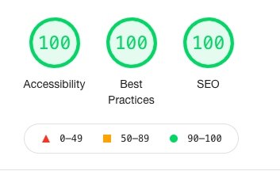
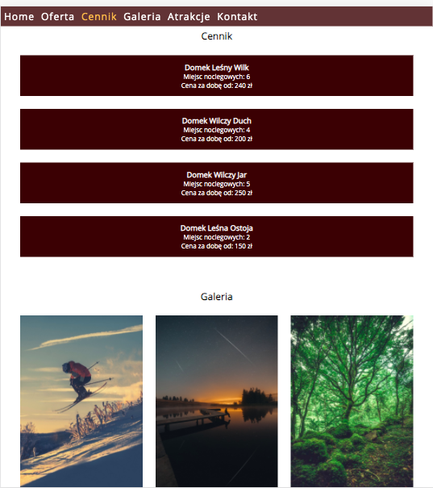
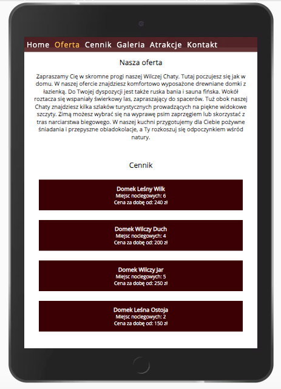
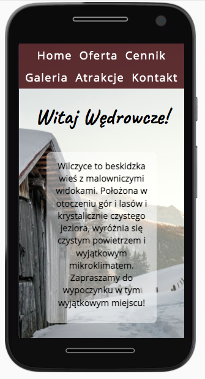

# CodersCamp 2020 - Projekt HTML & CSS

## Projekt HTML & CSS — Wizytówka / Portfolio

### LIVE DEMO: [Wilcza Chata](https://ustrojny.github.io/WilczaChata/)

**Projekt strony internetowej dla agroturystyki Wilcza Chata** 

Niniejsza strona to wizytówka agroturystyki Wilcza Chata w Beskidach. Projekt ma na celu zachęcić klientów do odwiedzenia tego miejsca, poprzez prezentację jego unikatowych walorów. Projekt uwzględnia podstawowe zasady dostępności oraz jest responsywny.
Kolorystka projektu nawiązuje do kolorów natury - brązu i zieleni. Dzięki zastosowaniu zmiennych CSS możemy w łatwy sposób dostosować projekt do własnych upodobań kolorystycznych.
Na stronie zaprezentowane zostały główne atrakcje tego miejsca, a także cennik oraz galeria. Dostępny jest również formularz kontaktowy (podstawowa walidacja pól tekstowych i adresu e-mail).

### W projekcie została zaprezentowana praktyczna znajomość poniższych zagadnień związanych z HTML & CSS:
- Box-model
- Kaskadowość CSS
- Selektory CSS
- Popularne tagi HTML
- Jak podpinać CSSa do HTMLa
- Zapisywanie kolorów
- Stylowanie tekstu
- Zewnętrzne ikony/fonty (fontawesome, google fonts)
- Flexbox
- Position (absolute, relative, fixed)
- Animacje keyframes
- Formularz
- Responsive Web Design

### Wykorzystane narzędzia zewnętrzne:
- Google Fonts (Open Sans, Caveat)
- Font Awesome (ikona drzewa)
- Accessibility developers tools & Lighthouse do oceny dostępności (accessibility)
- ImageOptim do zmniejszenia wielkości obrazów

### W celu zapewnienia dostępności strony:
- stosowałam semantyczny HTML
- zastosowałam kontrastowe kolory
- dodałam elementy label do pól formularza
- użyłam aria-label do oznaczenia formularza kontaktowego oraz linku powrotu do góry strony

#### Raport z Lighthouse

### W celu zapewnienia responsywności strony:
- zastosowałam jednostki relatywne (rem)
- wykorzystałam Flexboxa
- użyłam media queries

Strona wyświetla się poprawnie na różnych rozdzielczościach ekranów:
#### Desktop:

#### Tablet:

#### Mobile:

### Zdjęcia 
- Zdjęcia wykorzystane na stronie pochodzą z serwisu [Unsplash](https://unsplash.com/) (zdjęcie w tle) oraz ze strony mojego ulubionego górskiego fotografa Crisa Froese (zdjęcia w galerii). Zachęcam do wizyty na [jego stronie](https://crisfroesepics.com/).
